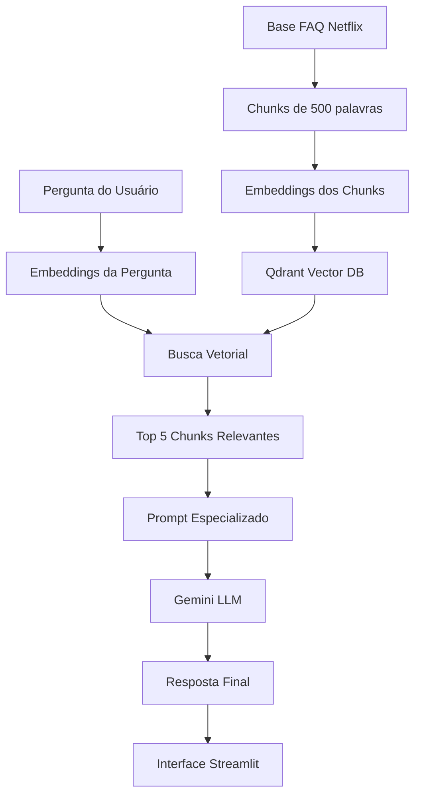

# NexFlix - Chatbot FAQ Netflix 🎬

Um chatbot de FAQ da Netflix construído com RAG (Retrieval Augmented Generation) que utiliza IA para fornecer respostas

## Arquitetura RAG



## Por que essas tecnologias?

- **Streamlit**: Framework leve e rápido para criar interfaces web com Python
- **Qdrant**: Banco vetorial criado para ser usado com LLM
- **Sentence Transformers**: Biblioteca para geração de embeddings
- **Gemini (Google)**: LLM gratuita para ser usada com a API

## Como Rodar Localmente

1. **Clone o repositório**
```bash
git clone [url-do-repo]
cd nextar
```

2. **Configure o ambiente**
```bash
# Crie e ative um ambiente virtual (opcional mas recomendado)
python -m venv venv
.\venv\Scripts\activate  # Windows
source venv/bin/activate # Linux/Mac

# Instale as dependências
pip install -r requirements.txt
```

3. **Configure as variáveis de ambiente**
- Crie um arquivo `.env` na raiz do projeto
- Adicione sua chave da API do Google:
```
GOOGLE_API_KEY=sua-chave-aqui
```

4. **Execute o aplicativo**
```bash
streamlit run app.py
```

## Estrutura do Projeto

```
├── app.py              # Aplicação Streamlit
├── backend/
│   ├── data/          # Dados e logs
│   └── services/      # Lógica principal
│       ├── RAG/       # Sistema de RAG
│       ├── LLM/       # Integração Gemini
│       └── logger/    # Sistema de logs
```

## Troubleshooting

- **Logs**: Verifique `backend/data/logs/app.log` para diagnóstico
- **Performance da resposta**: Use os expanders na UI para ver os chunks de contexto